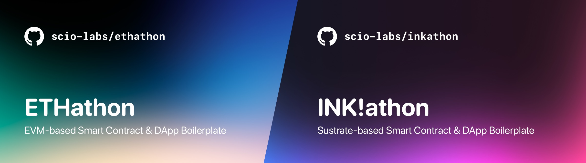

# HiKyaku Protocol – Email 🤝 web3 address



---

Resolve any email address to web3 address.

By [ken](https://twitter.com/kenichiNaoe), [Yoshi](https://twitter.com/yoshijo04), Tei

---

**Table of Contents:**

1. [The Stack](#the-stack)
2. [Projects using it](#projects-using-it)
3. [Getting Started](#getting-started)
4. [Development](#development)
   1. [Quickstart](#quickstart)
5. [Deployment](#deployment)

---

## The Stack

- Package-Manager: `pnpm`
- Monorepo Tooling: `turborepo`
- Smart Contract Development: `hardhat`
  - Deploy & Address-Export: `hardhat-deploy`
  - Typescript-Types: `typechain`
- Frontend: `next`
  - Contract Interactions: `wagmi`, `rainbowkit`
  - Styling: `chakra`, `tailwindcss`, `twin.macro`, `emotion`
- Misc:
  - Linting & Formatting: `eslint`, `prettier`, `husky`, `lint-staged`

## Projects using it

Below you find a few live projects that use ETHathon, a variation of it, or have a similar setup setup that inspired it:

- [Yieldgate](https://github.com/yieldgate/yieldgate) – Hackathon project that built a patreon-like platform to support projects with yield.
- [Debate3](http://debate3.xyz/) – Hackathon project that built discourse-like forums for DAOs.
- [Stablecoins.wtf](https://stablecoins.wtf/) (frontend only) – Crypto Stablecoin Dashboard & Resources

## Getting Started

```bash
# Install pnpm
npm i -g pnpm

# Install dependencies
pnpm install

# Copy & fill environments
# NOTE: Documentation of environment variables can be found in the according `.example` files
cp packages/frontend/.env.local.example packages/frontend/.env.local
cp packages/contracts/.env.example packages/contracts/.env
```

## Development

### Quickstart

```bash
# Generate contract-types, start local hardhat node, and start frontend with turborepo
pnpm dev

# Only start frontend (from root-dir)
# NOTE: Alternatively it can just be started via `pnpm dev` inside `packages/frontend`
pnpm frontend:dev
```

## Deployment

Setting up a deployment via Vercel is pretty straightforward as build settings are preconfigured in `vercel.json`. To get started, press the **Deploy** button and enter the default environment variables listed below.

[](https://vercel.com/new/clone?repository-url=https%3A%2F%2Fgithub.com%2Fethathon%2Fethathon&env=NEXT_PUBLIC_PRODUCTION_MODE,NEXT_PUBLIC_URL,NEXT_PUBLIC_DEFAULT_CHAIN,NEXT_PUBLIC_SUPPORTED_CHAINS,NEXT_PUBLIC_RPC_1,NEXT_PUBLIC_RPC_5&envDescription=See%20Environment%20Variables%20Examples%20%26%20Documentation&envLink=https%3A%2F%2Fgithub.com%2Fethathon%2Fethathon%2Fblob%2Fmain%2Fpackages%2Ffrontend%2F.env.local.example&redirect-url=https%3A%2F%2Fgithub.com%2Fethathon%2Fethathon)

| Environment Variable           | Value                             |
| ------------------------------ | --------------------------------- |
| `NEXT_PUBLIC_PRODUCTION_MODE`  | `true`                            |
| `NEXT_PUBLIC_URL`              | `https://your-repo.vercel.app`    |
| `NEXT_PUBLIC_DEFAULT_CHAIN`    | `5`                               |
| `NEXT_PUBLIC_SUPPORTED_CHAINS` | `[5]`                             |
| `NEXT_PUBLIC_RPC_1`            | `https://rpc.ankr.com/eth`        |
| `NEXT_PUBLIC_RPC_5`            | `https://rpc.ankr.com/eth_goerli` |

You can find mode documentation on those environment variables in [`packages/frontend/.env.local.example`](https://github.com/scio-labs/ethathon/blob/main/packages/frontend/.env.local.example). Always make sure to include respective RPCs for supported chains and define them within [`packages/frontend/src/shared/environment.ts`](https://github.com/scio-labs/ethathon/blob/main/packages/frontend/src/shared/environment.ts). Valid hardhat deployments under [`packages/contracts/deployments`](https://github.com/scio-labs/ethathon/blob/main/packages/contracts/deployments) are mandatory for each supported chain.
